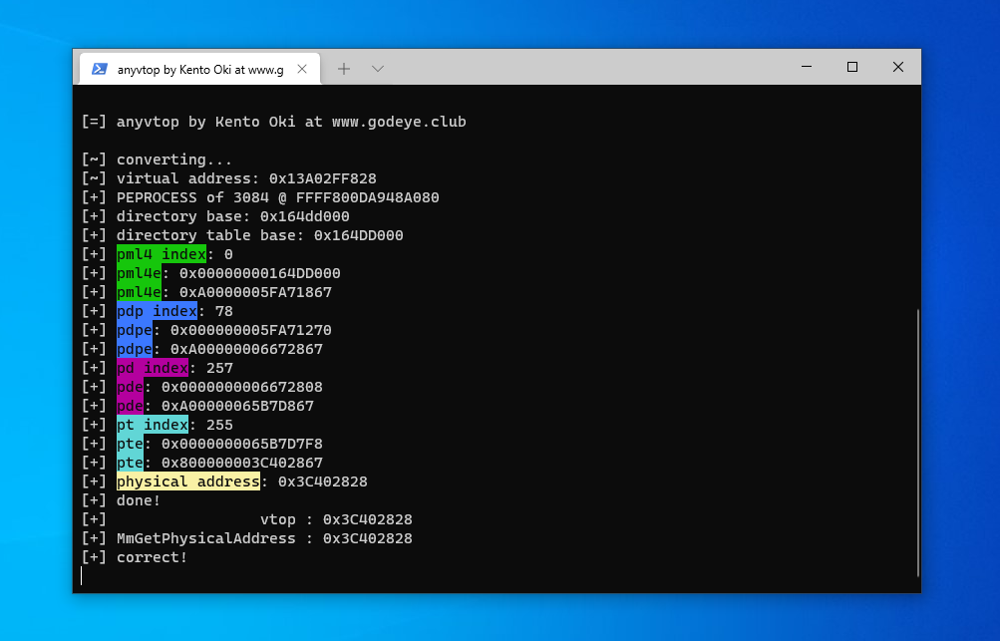

<p align="center">

  


</p>

# anyvtop

x64 Windows implementation of virtual-address to physical-address translation

# Windows Memory Management

Modern x64 Windows uses `PML4` *Page Map Level 4* as paging mode. careful that interpretation of the mode is a bit different with long/legacy mode on AMD64 and Intel64.  
This repository is an implementation of `virtual address` a.k.a `linear address` to `physical address` translation, that usually done by the CPU's `MMU` *Memory Management Unit*.

This implementation is similar to `MmGetPhysicalAddress`.  

## DTB

`DTB` is a *Directory Table Base* which represents the base physical address of paging table.  
Can be found at `nt!_EPROCESS.Pcb.DirectoryTableBase`, `PCB` means *Processor Control Block*.

```bash
dt nt!_KPROCESS DirectoryTableBase
  +0x028 DirectoryTableBase : Uint8B
```

If the virtual address is `KVA` *Kernel Virtual Address*, we could use system process's DTB.  
The system process's DTB represents exact same value contained in `CR3` because it is a part of the kernels.

Also if it is user's virtual address, ofcourse the DTB is different with the every single processes, so we have to lookup from the structure.

## Paging

There's 4 things we first understand,

- `PML4` Page Map Level 4
- `PDP` Page Directory Pointer
- `PD` Page Directory
- `PT` Page Table

### Steps

1. Lookup `DTB`
2. Lookup `PDP` entry using `DTB` entry's PFN and VA's `pml4_index`
3. Lookup `PD` entry using `PDP` entry's PFN and VA's `pd_index`
4. Lookup `PT` entry using `PD` entry's PFN and VA's `pt_index`
5. Translate to the physical address using `PT` entry's PFN and VA's `offset`, the first 12-bits value of virtual address.

## Extra: PML5

Some of you may know that there is `PML5` *Page Map Level 5* is available on Linux. (some versions)  
The `PML5` is expanded physical address to the `56-bits` allowing use of `4PiB` of physical address ranges and `128PiB` of virtual address ranges.  

Do you think that Windows should have `PML5`?

# License

MIT copyright Kento Oki \<hrn832@protonmail.com\>
